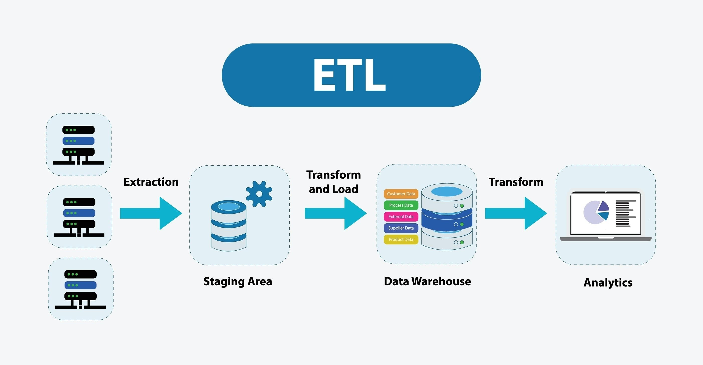

# 🚴‍♂️ Projet : The Paris Vélib' Monitor

Bienvenue. Si vous lisez ceci, c'est que vous envisagez de passer du côté technique de la Data ("Analytics Engineering").

Ce projet est conçu comme un jeu vidéo en 2 Phases. Il reproduit **exactement** ce que font les ingénieurs data en startup, mais gratuitement.

* **Phase 1 (Le MVP) :** On fait le pipeline "à la main" pour comprendre la logique (SQL, Modélisation, Dashboard).
* **Phase 2 (L'Industrialisation) :** On automatise tout avec du code et des outils d'infrastructure (Python, Docker, Airbyte).

---

## 🛠 Pré-requis & Outils

Avant de commencer, installez ces bases. C'est votre trousse à outils.
* **VS Code** (Votre atelier de code) : [Télécharger ici](https://code.visualstudio.com/)
* **Git** (Votre sauvegarde) : [Télécharger ici](https://git-scm.com/downloads)
* **Un compte Google** (Pour accéder au Cloud).

---

# 🏁 Phase 1 : Le MVP (Minimum Viable Product)

**Objectif :** Sortir un tableau de bord fonctionnel le plus vite possible, même si la méthode d'ingestion est "bricolée" (manuelle).

## Étape 1 : Le Cloud (BigQuery)

Vous n'allez pas stocker les données sur votre ordi (Excel), mais dans un "Data Warehouse" (Entrepôt de données).

### 🧠 C'est quoi le concept ?
Un **Data Warehouse** (comme BigQuery ou Snowflake) est une base de données sur-vitaminée.
* Contrairement à Excel, elle peut stocker des pétaoctets de données.
* Elle sépare le stockage (disque) du calcul (processeur), ce qui permet de lancer des requêtes très lourdes en quelques secondes.
* C'est ici que **toute** la donnée de l'entreprise atterrit.

### 🎯 Mission
1.  Aller sur la **Google Cloud Platform (GCP)** et créer un nouveau projet.
2.  Chercher "BigQuery" dans la barre de recherche.
3.  Créer un "Dataset" (un dossier) appelé `raw_velib`.
4.  Télécharger la donnée brute (un fichier JSON) sur votre ordi : [Data Vélib Temps Réel](https://velib-metropole-opendata.smoove.pro/opendata/Velib_Metropole/station_status.json)
5.  Créer une table `stations` dans votre dataset `raw_velib` en uploadant ce fichier JSON manuellement.

### 🔗 Liens utiles
* **Tuto Indispensable :** [Comment activer la BigQuery Sandbox (Gratuit)](https://cloud.google.com/bigquery/docs/sandbox?hl=fr)
* **Tuto :** [Charger un fichier local dans BigQuery](https://cloud.google.com/bigquery/docs/loading-data-local?hl=fr) (Regardez la partie "Console Cloud").

---

## Étape 2 : La Transformation (dbt & SQL)

C'est le cœur du métier d'Analytics Engineer. Votre donnée dans BigQuery est brute, sale et inutilisable par le métier.

### 🧠 C'est quoi le concept ?
On ne modifie jamais la source (`raw`). On crée une copie propre.
**"Nettoyer la donnée"** en SQL, ça veut dire précisément 3 choses :
1.  **Aliasing (Renommer) :** `num_bikes_available` c'est moche. On renomme en `nb_velos`.
2.  **Casting (Typer) :** Parfois un chiffre arrive comme du texte `"42"`. On doit le forcer à devenir un nombre `42` pour faire des additions.
3.  **Filtrage :** Enlever les lignes de test ou les erreurs.

On utilise **dbt (data build tool)** pour organiser ce SQL. C'est le standard du marché.


### 🎯 Mission
1.  Installer dbt sur votre ordinateur (via le terminal).
2.  Configurer dbt pour qu'il puisse parler à votre BigQuery (`dbt init`).
3.  Écrire un modèle SQL (`stg_stations.sql`) qui lit la table `raw` et crée une vue propre.

### 🔗 Liens utiles
* **La Bible :** [Tuto officiel dbt pour BigQuery](https://docs.getdbt.com/guides/bigquery?step=1) (Suivez "Installation" et "Connect").

### 🆘 Cheat Codes (Bloqué ?)

<details>
<summary>👀 <strong>Cheat 1 : Les commandes d'installation</strong></summary>

Ouvrez le terminal dans VS Code et tapez :
```bash
# Installe la version dbt qui parle à BigQuery
pip install dbt-bigquery

# Lance l'assistant de configuration
dbt init velib_project
```
Note : Si pip ne marche pas, réinstallez Python en cochant bien la case "Add to PATH" au début.

</details>

<details> <summary>👀 <strong>Cheat 2 : La connexion (profiles.yml)</strong></summary>

Quand dbt init vous demande la méthode d'authentification :

Choisissez OAuth (c'est le plus simple, ça ouvrira une fenêtre Google pour vous connecter).

Projet ID : L'ID de votre projet Google Cloud (pas le nom, l'ID !).

Dataset : le nom du dataset où dbt va écrire (mettez dbt_prod par exemple).

</details>

<details> <summary>👀 <strong>Cheat 3 : Le Code SQL attendu</strong></summary>

Créez un fichier dans models/staging/stg_stations.sql :

```sql
/*
   Ce modèle nettoie la donnée brute.
   Source : raw_velib.stations
*/

SELECT
    stationCode as station_id,          -- On renomme pour que ce soit clair
    name as station_nom,
    CAST(num_bikes_available AS INT64) as nb_velos_meca, -- On assure que c'est un entier
    CAST(num_ebikes_available AS INT64) as nb_velos_elec,
    (num_bikes_available + num_ebikes_available) as total_velos, -- On crée une métrique calculée
    capacity as capacite_totale
FROM `votre-projet-gcp.raw_velib.stations` -- Remplacez par votre vrai chemin
WHERE is_renting = 'OUI' -- On garde que les stations ouvertes
```
Puis lancez : dbt run

</details>

## Étape 3 : La Dataviz
La donnée est propre. Il faut maintenant raconter une histoire avec.

### 🎯 Mission
Aller sur Google Looker Studio.

Créer une "Source de données" -> Choisir BigQuery -> Choisir la table que dbt vient de créer (dans dbt_prod).

Créer une carte de Paris avec des bulles : la taille de la bulle = la capacité de la station.

# 🚀 Phase 2 : L'Industrialisation (Software Engineering)
Vous avez validé la logique métier. Mais votre système est nul : il faut uploader le fichier JSON à la main tous les matins. Un ingénieur automatise.

## Étape 4 : Python & API
On va remplacer votre clic manuel par un script.

### 🧠 C'est quoi le concept ?
API (Application Programming Interface) : C'est comme un serveur dans un resto. Vous (le client) demandez la carte, l'API vous la donne. Vous n'entrez pas en cuisine (la base de données).

JSON : C'est le format standard du Web pour échanger de la donnée. C'est structuré avec des accolades { "cle": "valeur" }.

### 🎯 Mission
Écrire un script extract_velib.py qui va chercher la donnée sur le web et nous la montrer.

### 🔗 Liens utiles
Apprendre les bases de Requests (Python)

### 🆘 Cheat Codes
<details> <summary>👀 <strong>Cheat : Le script Python simple</strong></summary>

```python
import requests # Librairie pour faire des requêtes HTTP
import json

print("🚀 Démarrage du script...")

url = "[https://velib-metropole-opendata.smoove.pro/opendata/Velib_Metropole/station_status.json](https://velib-metropole-opendata.smoove.pro/opendata/Velib_Metropole/station_status.json)"

# GET request
response = requests.get(url)

# Vérifier si ça a marché (Code 200 = OK)
if response.status_code == 200:
    data = response.json()
    print("✅ Donnée récupérée !")
    # Affiche la première station pour voir à quoi ça ressemble
    print(data['data']['stations'][0])
else:
    print("❌ Erreur de connexion")
```
</details>

## Étape 5 : Docker & Airbyte (Le niveau Pro)
Avoir un script Python c'est bien, mais on ne va pas le lancer à la main. On va utiliser un outil d'ingestion moderne : Airbyte, le tout encapsulé dans Docker.

### 🧠 C'est quoi le concept ?
Docker (Conteneurisation) : C'est un système qui permet de mettre un logiciel dans une boîte virtuelle. Ça évite les problèmes du type "ça marche sur mon ordi mais pas sur le tien".

Airbyte (ELT Tool) : C'est un logiciel open-source qui a des milliers de connecteurs. On lui dit "Prends la donnée de l'API Vélib" (Source) et "Mets-la dans BigQuery" (Destination). Il gère les erreurs, la fréquence, etc.



### 🎯 Mission
Installer Docker Desktop.

Installer Airbyte en local (via Docker).

Configurer Airbyte pour qu'il prenne le JSON Vélib et l'envoie dans BigQuery tout seul.

### 🔗 Liens utiles (Lisez-les, c'est dur ici !)
Installer Docker Desktop

Comment lancer Airbyte en local (Documentation)

CRUCIAL : Créer un Service Account Google pour Airbyte (Sans ça, Airbyte n'a pas le droit d'écrire dans BigQuery).

### 🆘 Cheat Codes (Configuration Airbyte)
<details> <summary>👀 <strong>Cheat : La config Source et Destination</strong></summary>

Une fois Airbyte lancé sur http://localhost:8000 :

Source : Cherchez "File" (Fichier).

Dataset Name : velib_live

URL : L'URL du JSON.

Format : JSON.

Destination : BigQuery.

Project ID : Votre ID GCP.

Dataset Location : EU (ou US selon votre config).

Service Account Key : C'est là qu'il faut coller le contenu du fichier JSON que vous avez téléchargé en créant votre Service Account sur GCP (voir lien ci-dessus).

</details>

### 🎉 Le Boss de fin
Si vous avez réussi tout ça, vous avez :

Un pipeline d'ingestion automatisé (Airbyte).

Un pipeline de transformation propre (dbt).

Un dashboard qui se met à jour.

C'est littéralement la Modern Data Stack. Prenez une capture d'écran de votre "Lineage" dbt (le graphe qui montre les tables) et de votre Dashboard. C'est votre premier projet portfolio.